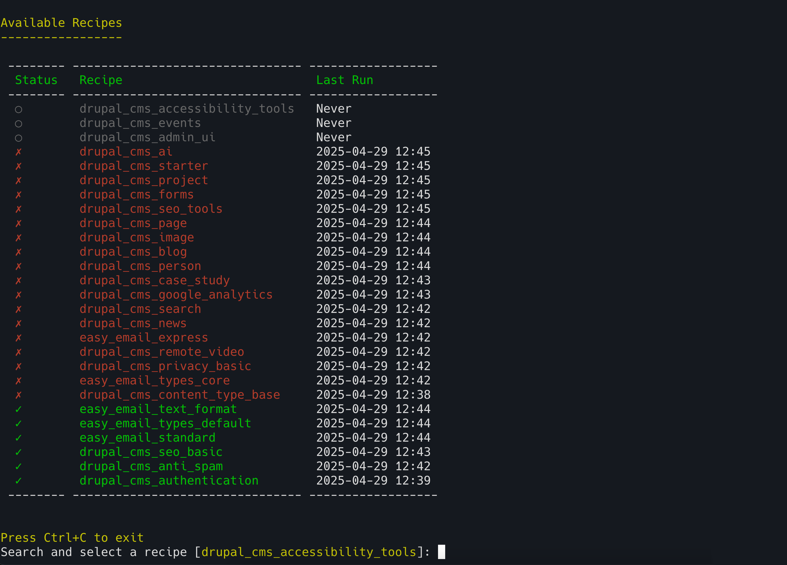

# Drupal Recipe Manager

A CLI tool for managing and executing Drupal recipes.



## Quick Start

1. Install:
2. 
```bash
composer require --dev d34dman/drupal-recipe-manager
```

2. Create `drupal-recipe-manager.yaml`:

```yaml
scanDirs:
  - recipes
  # - web/core/recipes  # Uncomment to include core recipes
commands:
  ddevRecipe:
    description: "🚀 Run Drush recipe command using ddev"
    command: "ddev drush recipe ../${folder}"
    requiresFolder: true
logsDir: recipes/logs
```

## Commands

The executable should be available inside `/vendor/bin/drupal-recipe-manager`

```
$ /vendor/bin/drupal-recipe-manager recipe
```

| Command | Description |
|---------|-------------|
| `recipe` | Interactive recipe selection and execution |
| `recipe --list` | List all recipes with status |
| `recipe [recipe-name]` | Run a specific recipe |
| `recipe:dependencies` | Show recipe dependencies interactively |
| `recipe:dependencies [recipe-name]` | Show dependency tree for a recipe |
| `recipe:dependencies --inverted` | Show which recipes depend on a recipe |

## Features

- **Interactive UI**: Beautiful terminal interface with color-coded status
- **Status Tracking**: 
  - ✓ Green: Successfully executed
  - ✗ Red: Failed execution
  - ○ Gray: Not executed yet
- **Dependency Management**: Automatic handling of recipe dependencies
- **Custom Commands**: Configure your own recipe execution commands
- **Variable Transformations**: Customize paths and variables

## Configuration

### Directories
- `scanDirs`: List of directories to scan for recipes
- `logsDir`: Directory for storing logs

### Variables
```yaml
variables:
  - name: "folder_relative"
    input: "${folder}"
    search: "^.*?recipes/"
    replace: ""
```

## Requirements

- PHP 8.2+
- Composer
- Drupal installation with recipes

## License

MIT License - See LICENSE file for details.

## Author

D34dman (shibinkidd@gmail.com) 