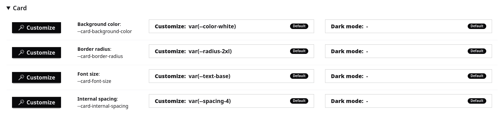
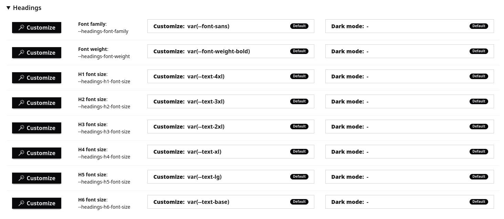
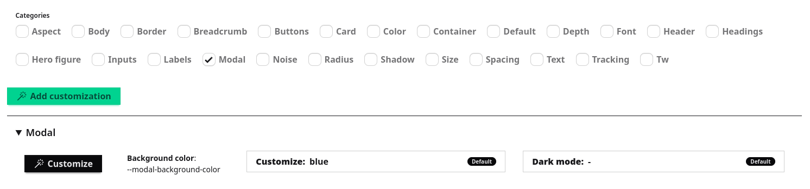

Welcome board captain!

We heard you! Artisan 2.x Complex made easy. Of course you will require to get familiar with the proposal or adjust completely your own way!
A world of customizations in the palm of your hand.

Artisan 2.x arises from the need to have a base theme that allows most of its components to be reused without having to completely overwrite them in the custom theme of a specific project.
Its objective is to offer a functional, fast and consolidated design base that is easily extensible.

From interface, we can define aspects such as the main color palette, page width and font sizes for different elements.
These settings become CSS variables applied to specific elements, allowing you to have a functional base design quickly and without the need to compile CSS or empty the cache.

## Installation & Setup

### npm and node minimal versions
- npm >=6.14
- node >=12.14

### Install the theme
Just as you would normally install a contributed Drupal module or theme via Composer.
```bash
composer require drupal/artisan
```

### Drush command to generate a new theme (generation, compiling, install & set default)
```twig
drush --include="web/themes/contrib/artisan" artisan
```

*Optional "name" param can be passed, used with "-y" it will make everything without asking anything.
```twig
drush --include="web/themes/contrib/artisan" artisan "Artisan Mysite" -y
```


### To update build
```twig
npm run build
```
```twig
npm run build:watch
```

### Vite dev mode

When using ddev expose port ".ddev/config.yaml":
```yaml
web_extra_exposed_ports:
- name: nodejs
  container_port: 3000
  http_port: 3001
  https_port: 3000
```

Restart ddev after having port accesible 3000
```bash
ddev restart
```

Execute npm dev task from your theme
```bash
cd web/themes/custom/[ARTISAN_SUBTHEME_FROM_STARTERKIT]
npm run dev
```

Clear cache
```
ddev drush cr
```

Thats it! Note build source files should be used in components libraries definitions (more info into components section), then by Artisan will handle automatically dist or dev resources from library definition & vite manifest.

Now css/js from vite dev will be used directly along with vite client to have live preview without reloading page in browser. You can check that resources now loads from "external" url "https://[SITE].ddev.site:3000/themes/custom/[ARTISAN_SUBTHEME_FROM_STARTERKIT]/dist"

#### Different vite dev url & port
If dev mode is not automatically active after previous steps or maybe you want to specify different url or port.
Then go to your theme settings (e.g: /admin/appearance/settings/artisan_starterkit) & adjust "Vite: Dev host" & "Vite: Dev port", also ensure you specify same route & port into your theme "vite.config.js" file "serverPort = 3000;" & "serverOriginHost = 'https://my-drupal-site.ddev.site';".

NOTE: Wrong setup may result into not loaded styles.


### Artisan Styleguide - Optional ecosystem module
You can also optionally install complementary module https://www.drupal.org/project/artisan_styleguide to help you visualize, iterate & refine your new theme SDCs by "/artisan-styleguide" guidelines.

## Artisan Customizer
Artisan Customizer is a **CSS variables manager**. It allows you to create or edit CSS variables directly from Drupal UI.

Customizer is available on /admin/appearance/settings/{your_custom_theme} under Appearance --> Configuration --> {Your theme name}.

### How it works
By automatically detecting any CSS variables declared on your theme, provides a form with several filters that allows you to create or find any CSS Var and modifying its value with several helper widgets.

Artisan Customizer **ships with a default set of CSS variables** already mapped to specific components (such as Card or Hero, Collapse...) and base elements (such as Buttons, Inputs, Headings...). Also some
base theme variables such as base primary color, spacings, font-family, font-sizes, container widths...




### Extending
You can create CSS variables directly from the UI or from your theme. The Customizer will automatically detect these variables and categorize them based on the names you assign.

Example: You just created a new modal SDC and created a CSSS variable defined as --modal-background-color: A new category called Modal will appear will a CSS Var labeled as Background color.



## Artisan components
Please read carefully to succesfully create / modify current or new components.

- **SDC (single directory components)** drupal standard declarations, further usage will be included with core development (types, variants, design tokens, etc) but any feature never will be used before is included into stable core version first.
- **Tailwindcss / daisyui styles**.
- **Typescript** for built files usage.
- **Webcomponents standard*** optional implementation for dynamic or interactable ones (chart, widget, etc), **lit or vanilla** based.
- **Enhanced or vanilla components support**.
- **Tree Shaking optimization** not used classes / styles won't be included into built assets.
- **Vite** build process (pre-build provided). Used to process styles (tailwindcss) & scripts (typescript).
- **CSS layers**: "@layer components" for components.
- **BEM based custom styles** preferred. Use block-element-modifier for classes naming.
- **Automatic customizations in theme settings**: when declared according to suggestions.

### Webcomponents

This concept groups mainly other three:
- **Shadow DOM**: JS API for isolated / internal element dom, scripts & styles.
- **Custom elements**: JS API to create new "html tag elements" like native but your own way. Always use two-word declarations.
- **HTML templates**: ```<template>``` y ```<slot>``` non visible directly but reusable declarations. Note it fits with SDC slots declarations.


## How Artisan manage components
To integrate all those concepts & standards providing the most flexible base, lets categorize components in two types; **enhanced & vanilla components**.

### Enhanced components (dist / build required)
**It requires its css & ts/js files to be built using vite** (npm compiler task).

#### Key points:
- **Require build process**.
- **Folder "src" for css/ts files**.
- Component "libraryOverrides" to declare type module ts script and/or css files (my-component/src/my-component.css & my-component/src/my-component.ts).
- Component build files auto wired with main theme buid/dev tasks.
- Use **typescript** (not javascript)
- Use **tailwindcss / daisyui css enhancements** / any other theme related styles (declare new utility classes, apply, reference).
- Use **lit webcomponent**.
- Use **explicit external dependencies** (like colors.io, webcomponents.org, etc, node package depenencies not any from Drupal library definition).
- Script type module (**composable scripts**, import export, etc).
- Styles admit **artisan automatic customizations** when declared properly.
- SDC twig template tailwindcss / daisyui usable classes.

#### Enhanced styles
Component that defines my-component/src/my-component.css or enhanced-styles-component/src/enhanced-styles-component.css style file similar to this:
```css
/* Note imports aliased */
/* Import init layers to avoid wrong layers scructure if this file is loaded before main.css */
@layer theme, base, components, utilities;
/* Import tailwind init reference */
@reference "@src/main.css";
/* Important to use components layer. */
@layer components {
  @import "../../../node_modules/daisyui/components/card.css";
  :root, :host {
    --card-internal-spacing: var(--spacing-4);
    --card-font-size: var(--text-base);
    --card-border-radius: var(--radius-2xl);
    --card-background-color: var(--color-white);
  }
  .card {
    border-radius: var(--card-border-radius);
    img {
      border-radius: var(--card-border-radius);
    }
    .card-body {
      font-size: var(--card-font-size);
      padding: var(--card-internal-spacing);
    }
  }
}
```

#### Enhanced javascript
Composable script (must be declared as type module). Enhanced dependencies will be resolved in browser as composable module script standard suggests, also it will be reused for multiple components usage (avoid dependency duplication as vite build process will isolate them into reusable module importable scripts).

Component that defines my-component/src/my-component.ts or enhanced-javascript-component/src/enhanced-javascript-component.ts script file similar to this (webcomponent lit example):
```typescript
/* Note imports aliased */
import { LitElement, html, css } from 'lit';
import { customElement } from 'lit/decorators.js';

/**
 * A component built with Lit.
 */
@customElement('enhanced-javascript-component')
export class EnhancedJavascriptComponent extends LitElement {

  /**
   * You can use any css property / variable here (declared into main dom & it will work).
   */
  static styles = css`
    :root, :host {
      background: var(--enhancedJavascriptComponent-background, white);
    }
  `;

  /**
   * Render the component
   */
  render() {
    return html`
      <h2>Enhanced javascript component</h2>
      <slot name="content"></slot>
    `;
  }
}

// Declare the element for TypeScript
declare global {
  interface HTMLElementTagNameMap {
    'enhanced-javascript-component': EnhancedJavascriptComponent;
  }
}
```

Also SDC twig will be something like:
```twig

<enhanced-javascript-component{{ attributes.addClass('enhanced-javascript-component') }}>
  
    <div slot="content">{{ content }}</div>
  
</enhanced-javascript-component>
```

#### Enhanced dependencies
Component using "enhanced javascript" that uses npm dependencies direcly. It will be included automatically into main theme package.json as it is defined as npm workspace (/components/**/*).
Defines "package.json" similar to this (example to add chart.js):
```json
{
  "name": "enhanced-dependencies-component",
  "version": "1.0.0",
  "private": true,
  "description": "...",
  "dependencies": {
    "chart.js": "^4.4.0"
  }
}
```
Also into enhanced src/*.ts file:
```typescript
...
import { Chart, registerables } from 'chart.js';
...
```

### Vanilla components (non dist / build required)
No requirement to compile at all. Deined css/js files will be used directly (no compiler process).

#### Key points:
- **Does not require build process**; delared js/css will be used directly in browser.
- **Styles css/js directly over compnent main folder** (my-component/my-component.css & my-component/my-component.js).
- **No need to declare component "libraryOverrides"**; files will be auto-attached on sdc usage per Drupal mechanism (at least if you don't need explicit overrides).
- Use **vanilla webcomponent**.
- Use **javascript** (not typescript).
- **No explicit external dependencies** (optional drupal library defined dependencies usage).
- **Regular script type** (non composable scripts, no import, no export).
- Styles admit **artisan automatic customizations** when declared properly.
- SDC twig template tailwindcss / daisyui usable classes.

#### Vanilla styles
This component does not use any other style or js from theme beyon inherited styles (css properties mainly).

Component that defines my-component/my-component.css or vanilla-styles/vanilla-styles.css (non src) style file similar to this (choose 1 or 2):
```css
/* ************ 1. COMPONENT WITH CUSTOMIZATIONS (RECOMMENDED) ************ */

/* Note import unaliased */
/* Import init layers to avoid wrong layers scructure if this file is loaded before main.css */
@import url("../../src/_init-layers.css");

/* Important to use components layer. */
@layer components {
  /* Use base layer to add dedicated component properties/variables; styles will result into components.base layer (note nesting). */
  @layer base {
    :root, :host {
      /* These new customizations will appear in theme settings customizer automatically */
      --vanillaStylesComponent-internalSpacing: var(--spacing-4);
      --vanillaStylesComponent-borderRadius: 2rem;
    }
  }
  @layer components {
    /* Main component selector class or attribute. */
    /* [data-component-id="artisan_starterkit:vanilla-styles-component"] or ".vanilla-styles-component" */
    .vanilla-styles-component {
      padding: var(--vanillaStylesComponent-internalSpacing);
      border-radius: var(--vanillaStylesComponent-borderRadius);
    }
  }
}

/* ************ 2. FREESTYLE COMPONENT WITHOUT CUSTOMIZATIONS (NOT RECOMMENDED) ************ */
/* Main component selector class or attribute. */
/* [data-component-id="artisan_starterkit:vanilla-styles-component"] or ".vanilla-styles-component" */
.my-freestyle-vanilla-styles-component {
  /* Here you can use theme variables / properties too but not existing & customizable or new semantic non customizable per customizer. */
  background-color: var(--color-branding);
}
```

### Vanilla javascript
Regular script (non composable) (must NOT be declared as type module).
Component that defines my-component/my-component.js or vanilla-javascript-component/vanilla-javascript-component.js script file similar to this (webcomponent html example):
```javascript
/* ************ 1. Webcomponent Shadow DOM over existing elements example ************ */

// Create a shadow DOM for the element of your choice like "header".
const header = document.getElementById('header');
// Init open/closed shadow DOM.
const shadowRoot = header.attachShadow({mode: 'open'}); // or closed
// Add styles and content to the shadow DOM.
const headerStyles = document.createElement("style");
// Add regular elements to the shadow DOM (h1).
const headerHeading = document.createElement("h1");
// Manipulate the shadow DOM like you need.
headerHeading.textContent = "Shadow DOM H1 (this will be replaced in 5s)";
headerStyles.textContent = `
  h1 { color: var(--test); }
`;
shadowRoot.appendChild(headerStyles);
shadowRoot.appendChild(headerHeading);
setTimeout(() => shadowRoot.innerHTML = '<h1>Replaced by shadow DOM</h1>', 5000);

/* ************ 2. Webcomponent template declaration vanilla ************ */

const template = document.createElement('template');
template.innerHTML = `
  <h2>Webcomponent vanilla</h2>
  <slot name="content"></slot>
`;

/* ************ 3. Webcomponent custom element vanilla ************ */

/**
 * Webcomponent vanilla.
 */
class WebcomponentVanilla extends HTMLElement {

  /**
   * Constructor
   */
  constructor() {
    super();

    // Create shadow DOM
    this.attachShadow({ mode: 'open' });

    // Clone and attach template
    this.shadowRoot.appendChild(template.content.cloneNode(true));
  }
}

// Register the custom element
customElements.define('webcomponent-vanilla', WebcomponentVanilla);
```

### Vanilla dependencies
Component using dependencies from Drupal libraries explicit declarations.
Just add over "libraryOverrides" and into script as regular sdc.

Example:
```twig
libraryOverrides:
  dependencies:
    - core/drupal
    - core/drupal.debounce
    - core/once
```

```javascript
if (!Drupal) {
  // Avoid to fail when used outside drupal provide "external dependencies".
  return;
}
(function (Drupal, debounce, once) {
  Drupal.behaviors.vanilla_dependencies_component = {
    attach: function (context, settings) {
      once('vanilla-dependencies-component-whatever', 'vanilla-dependencies-component-whatever', context).forEach(whatever);
    }
  };

  /**
   * Whatever.
   */
  function whatever(element) {
    ...
  }
})(Drupal, Drupal.debounce, once);

```

### Conclusion
Use enhanced or vanilla (styles and/or script) according to each component need.

## SDC

### SDC Usage
- Global **attributes** property at the first DOM level, then specific attributes if needed.
- SDC embeds or includes should be done with the 'only' option, in order to avoid SDC unexpected/unnecessary variables scope.

Example:
```twig
 
```

- Artisan SDCs css/js: inside "src" for enhanced styles / typescript, outside for vanilla (check "How Artisan manage components" section).
- Artisan SDC should be customizable enough to avoid having to override completely, in most use cases, by attributes (genereral & specific) props, slots by twig blocks to customize its content & additional elements by bem class or additional specific attributes but with extra preset of minimal needed classes (by .addClass).


Example SDC with mandatory attributes
```twig
<div attributes.addClass(['swiper'])>
  <div swiper_wrapper_attributes.addClass(['swiper-wrapper'])>
    <div swiper_slides_attributes.addClass(['swiper-slide'])>Slide 1</div>
  </div>
</div
```

Usage of this SDC, adding additional classes
```twig


```

## Helpful

### Sitcky / fixed top auto calculated
In order to place an element like a search sidebar positioned sticky or fixed
you will be able to use "--theme-sticky-fixed-offset-top" CSS variable.
So top position is auto calculated & refreshed taking into account possible
sticky header & admin menu toolbar.

## Authors
- [Cristian Aliaga](https://www.drupal.org/u/crzdev)
- [Alejandro Cabarcos](https://www.drupal.org/u/alejandro-cabarcos)
- [Fran Rouco](https://www.drupal.org/u/frouco)
- [Alberto Antoranz](https://www.drupal.org/u/alzz)
